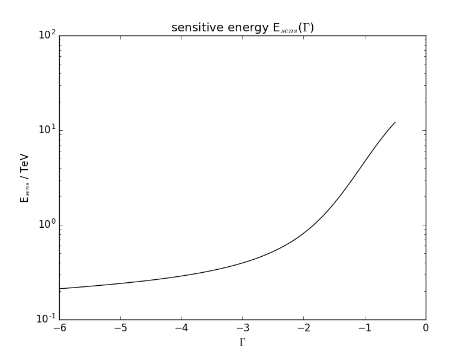

# gamma_limits_sensitivity
[](https://travis-ci.org/mahnen/gamma_limits_sensitivity) [](https://landscape.io/github/mahnen/gamma_limits_sensitivity/master) [](https://www.quantifiedcode.com/app/project/14c7f1a7c1b941ac87f49f4d3fc880c9) [](https://codecov.io/gh/mahnen/gamma_limits_sensitivity) 
 [](https://arxiv.org/list/astro-ph.HE/recent) 

This code calculates powerful and universal integral upper limits, sensitivities, and times to detection for gamma ray telescopes, assuming the underlying unseen source emission behaves as a power law in energy. All implemented functionality is based on the paper linked in the arxiv.org|astro-PH.HE badge above. 

In order to install, use python3 and pip:

```
pip install git+https://github.com/mahnen/gamma_limits_sensitivity.git
```

Or clone the repo and run the setup.py from there:

```
git clone https://github.com/mahnen/gamma_limits_sensitivity.git
cd gamma_limits_sensitivity
pip install .
```

The repo has been sucessfully used in python2.7 (with some hickups) --- at the moment support is not foreseen. 

__How it works__

There are three main commands that **gamma_limits_sensitivity** can excecute. These are:
- (**ul**): calculate integral upper limits 
- (**sens**): calculate sensitivity given an observation time t_obs
- (**predict**): calculate time to detection, given an uncertain source spectrum (independent normal distributed errors are assumed)

[comment]: # "All three use the integral spectral exclusion zone method and the representation of integral limits in the phase space of the power law source emission. Reference: xyz Link "

```
Usage:
  gamma_limits_sensitivity ul --l_lim=<arg> --t_obs=<arg> --A_eff=<file> [--out=<path>]
  gamma_limits_sensitivity sens --s_bg=<arg> --alpha=<arg> --t_obs=<arg> --A_eff=<file> [--out=<path>]
  gamma_limits_sensitivity predict --s_bg=<arg> --alpha=<arg> --f_0=<arg> --df_0=<arg> --Gamma=<arg> --dGamma=<arg> --E_0=<arg> --A_eff=<file> [--out=<path>]
  gamma_limits_sensitivity (-h | --help)
  gamma_limits_sensitivity --version

Options:
  --l_lim=<arg>         Signal count limit, estimated from n_on, n_off, and alpha
  --t_obs=<arg>         Observation time / s
  --A_eff=<file>        File with samples from the effective area after all cuts
  --out=<path>          Optional argument for specifying the output directory
  --alpha=<arg>         Ratio of On to Off region exposures
  --s_bg=<arg>          Estimated rate of background in On region / s
  --f_0=<arg>           Flux normalization / [1/(cm^2 s TeV)]
  --df_0=<arg>          Error of the flux normalization (1 sigma) / [1/(cm^2 s TeV)]
  --Gamma=<arg>         Emission power law index (< 0)
  --dGamma=<arg>        Error of the emission power law index (1 sigma)
  --E_0=<arg>           Reference energy / TeV
  -h --help             Show this screen.
  --version             Show version.
```

__How it also works__

In case you want to use gamma_limits_sensitivity in your own python analysis, you can import it and use the member functions directly. The API is the same as for the command line interface:

```python
import gamma_limits_sensitivity as gls

a_eff_file = 'gamma_limits_sensitivity/resources/A_eff/VERITAS_V5_lowZd_McCutcheon.dat'
l_lim = 11.3
t_obs = 25200
result_dict = gls.upper_limit(lambda_lim=l_lim, t_obs=t_obs, a_eff=a_eff_file)

result_dict['plots']['ul_sensitive_energy'].show()
```
In this case, the resulting plot shown is:

